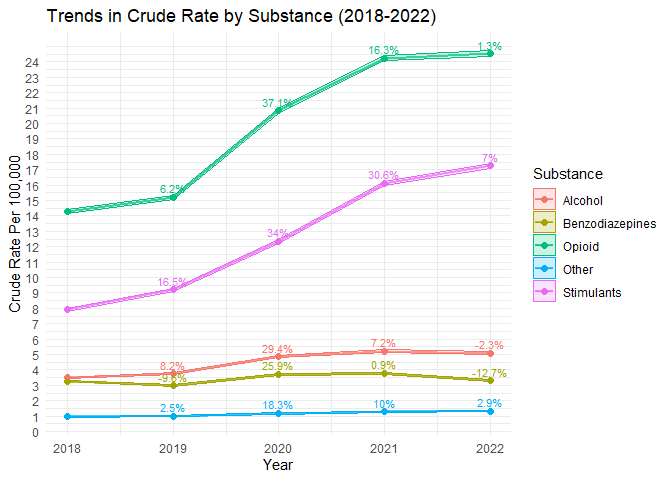
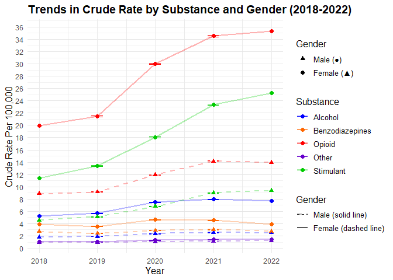

Untitled
================
Yining He
2024-12-05

``` r
library(readxl)
library(ggplot2)
library(dplyr)
```

    ## 
    ## Attaching package: 'dplyr'

    ## The following objects are masked from 'package:stats':
    ## 
    ##     filter, lag

    ## The following objects are masked from 'package:base':
    ## 
    ##     intersect, setdiff, setequal, union

``` r
library(tidyverse)
```

    ## ── Attaching core tidyverse packages ──────────────────────── tidyverse 2.0.0 ──
    ## ✔ forcats   1.0.0     ✔ stringr   1.5.1
    ## ✔ lubridate 1.9.3     ✔ tibble    3.2.1
    ## ✔ purrr     1.0.2     ✔ tidyr     1.3.1
    ## ✔ readr     2.1.5

    ## ── Conflicts ────────────────────────────────────────── tidyverse_conflicts() ──
    ## ✖ dplyr::filter() masks stats::filter()
    ## ✖ dplyr::lag()    masks stats::lag()
    ## ℹ Use the conflicted package (<http://conflicted.r-lib.org/>) to force all conflicts to become errors

``` r
# Load the data from the Excel file
data <- read_excel("Figure data.xlsx", sheet = "Year")

# Filter the data for the required substances and years (2018-2022)
substances <- c("Opioid", "Alcohol", "Stimulants", "Benzodiazepines", "Other")
filtered_data <- data %>%
  filter(Substances %in% substances, Year >= 2018 & Year <= 2022) %>%
  arrange(Substances, Year) %>%
  group_by(Substances) %>%
  mutate(`Percent Change` = ( (`Crude Rate` - lag(`Crude Rate`)) / lag(`Crude Rate`) ) * 100)

# Create the trend line plot with points, 95% CI, error bars, and percentage change labels
ggplot(filtered_data, aes(x = Year, y = `Crude Rate`, color = Substances)) +
  geom_line(size = 1, alpha = 0.7) +
  geom_point(size = 2) +
  geom_ribbon(aes(ymin = `Crude Rate Lower 95% Confidence Interval`, 
                  ymax = `Crude Rate Upper 95% Confidence Interval`, 
                  fill = Substances), alpha = 0.2) +
  geom_errorbar(aes(ymin = `Crude Rate` - `Crude Rate Standard Error`, 
                    ymax = `Crude Rate` + `Crude Rate Standard Error`), 
                width = 0, size = 0.5) +
  geom_text(aes(label = ifelse(is.na(`Percent Change`), "", 
                               paste0(round(`Percent Change`, 1), "%"))),
            vjust = -0.5, size = 3, show.legend = FALSE) +
  labs(title = "Trends in Crude Rate by Substance (2018-2022)",
       x = "Year",
       y = "Crude Rate Per 100,000",
       color = "Substance",
       fill = "Substance") +
  scale_y_continuous(breaks = seq(0, max(filtered_data$`Crude Rate`, na.rm = TRUE), by = 1)) +
  theme_minimal()
```

    ## Warning: Using `size` aesthetic for lines was deprecated in ggplot2 3.4.0.
    ## ℹ Please use `linewidth` instead.
    ## This warning is displayed once every 8 hours.
    ## Call `lifecycle::last_lifecycle_warnings()` to see where this warning was
    ## generated.

<!-- -->

``` r
# Load the data from the Excel file
data <- read_excel("Figure data.xlsx", sheet = "Gender")

# Filter the data for the required substances and years (2018-2022)
substances <- c("Opioid", "Alcohol", "Stimulant", "Benzodiazepines", "Other")
filtered_data <- data %>%
  filter(Substance %in% substances, Year >= 2018 & Year <= 2022)

# Separate data by gender
male_data <- filtered_data %>%
  filter(Gender == "Male") %>%
  arrange(Substance, Year) %>%
  group_by(Substance) %>%
  mutate(`Percent Change` = ( (`Crude Rate` - lag(`Crude Rate`)) / lag(`Crude Rate`) ) * 100)

female_data <- filtered_data %>%
  filter(Gender == "Female") %>%
  arrange(Substance, Year) %>%
  group_by(Substance) %>%
  mutate(`Percent Change` = ( (`Crude Rate` - lag(`Crude Rate`)) / lag(`Crude Rate`) ) * 100)

# Create the trend line plot for males
ggplot(male_data, aes(x = Year, y = `Crude Rate`, color = Substance)) +
  geom_line(size = 1, alpha = 0.7) +
  geom_point(size = 2) +
  geom_ribbon(aes(ymin = `Crude Rate Lower 95% Confidence Interval`, 
                  ymax = `Crude Rate Upper 95% Confidence Interval`, 
                  fill = Substance), alpha = 0.2) +
  geom_errorbar(aes(ymin = `Crude Rate` - `Crude Rate Standard Error`, 
                    ymax = `Crude Rate` + `Crude Rate Standard Error`), 
                width = 0, size = 0.5) +
  geom_text(aes(label = ifelse(is.na(`Percent Change`), "", 
                               paste0(round(`Percent Change`, 1), "%"))),
            vjust = -0.5, size = 3, show.legend = FALSE) +
  labs(title = "Trends in Crude Rate by Substance for Males (2018-2022)",
       x = "Year",
       y = "Crude Rate Per 100,000",
       color = "Substance",
       fill = "Substance") +
  scale_y_continuous(breaks = seq(0, max(male_data$`Crude Rate`, na.rm = TRUE), by = 1)) +
  theme_minimal()
```

<!-- -->

``` r
# Create the trend line plot for females
ggplot(female_data, aes(x = Year, y = `Crude Rate`, color = Substance)) +
  geom_line(size = 1, alpha = 0.7) +
  geom_point(size = 2) +
  geom_ribbon(aes(ymin = `Crude Rate Lower 95% Confidence Interval`, 
                  ymax = `Crude Rate Upper 95% Confidence Interval`, 
                  fill = Substance), alpha = 0.2) +
  geom_errorbar(aes(ymin = `Crude Rate` - `Crude Rate Standard Error`, 
                    ymax = `Crude Rate` + `Crude Rate Standard Error`), 
                width = 0, size = 0.5) +
  geom_text(aes(label = ifelse(is.na(`Percent Change`), "", 
                               paste0(round(`Percent Change`, 1), "%"))),
            vjust = -0.5, size = 3, show.legend = FALSE) +
  labs(title = "Trends in Crude Rate by Substance for Females (2018-2022)",
       x = "Year",
       y = "Crude Rate Per 100,000",
       color = "Substance",
       fill = "Substance") +
  scale_y_continuous(breaks = seq(0, max(female_data$`Crude Rate`, na.rm = TRUE), by = 1)) +
  theme_minimal()
```

<!-- -->

``` r
# Remove geom_text() for cleaner visualization
p <- ggplot(filtered_data, aes(x = Year, y = `Crude Rate`, 
                         color = Substance,    # 按物质类型上色
                         shape = Gender,       # 按性别区分形状
                         linetype = Gender)) + # 按性别区分线型
  # 先画线
  geom_line(size = 1, alpha = 0.3) +  
  # 再画点
  geom_point(size = 2) +
  # 误差棒
  geom_errorbar(aes(ymin = `Crude Rate` - `Crude Rate Standard Error`, 
                    ymax = `Crude Rate` + `Crude Rate Standard Error`), 
                width = 0.2, 
                size = 0.5) +
  # 设置形状：男性圆点，女性三角形
  scale_shape_manual(values = c("Male" = 16, "Female" = 17),
                    labels = c("Male (●)", "Female (▲)")) +  
  # 设置线型：男性实线，女性虚线
  scale_linetype_manual(values = c("Male" = "solid", "Female" = "dashed"),
                       labels = c("Male (solid line)", "Female (dashed line)")) +  
  # 设置颜色
  scale_color_manual(values = c(
    "Opioid" = "#FF0000",          # 红色
    "Alcohol" = "#0000FF",         # 蓝色
    "Stimulant" = "#00CC00",      # 绿色
    "Benzodiazepines" = "#FF6600", # 橙色
    "Other" = "#6600CC"            # 紫色
  )) +
  # 设置x轴
  scale_x_continuous(
    breaks = seq(from = 2018, to = 2022, by = 1),
    limits = c(2018, 2022)
  ) +
  # 设置y轴
  scale_y_continuous(
    breaks = seq(0, ceiling(max(filtered_data$`Crude Rate`, na.rm = TRUE)), by = 2)
  ) +
  # 设置标签
  labs(title = "Trends in Crude Rate by Substance and Gender (2018-2022)",
       x = "Year",
       y = "Crude Rate Per 100,000",
       color = "Substance",
       shape = "Gender",
       linetype = "Gender") +
  theme_minimal() +
  theme(
    plot.title = element_text(size = 14, face = "bold"),
    axis.title = element_text(size = 12),
    legend.title = element_text(size = 12),
    legend.text = element_text(size = 10),
    legend.position = "right",
    panel.grid.major.y = element_line(color = "gray90"),
    panel.grid.minor.y = element_line(color = "gray95"))

# Print the updated plot
print(p)
```

<!-- -->
