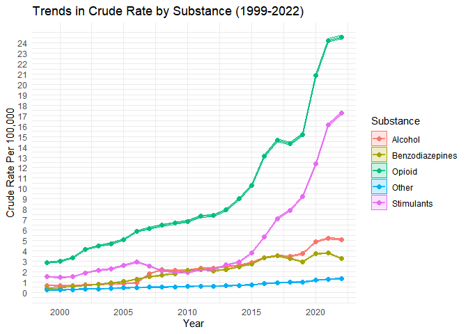
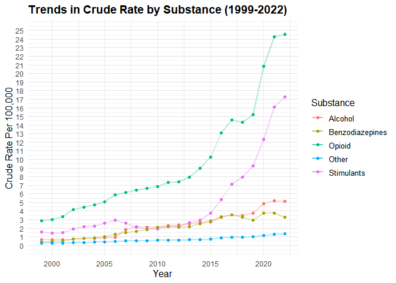
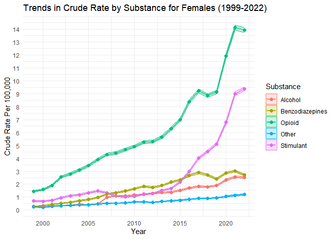
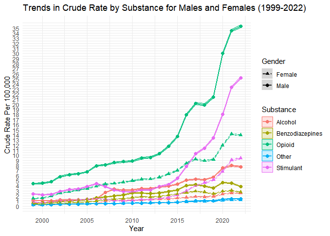

Untitled
================
Yining He
2024-11-19

``` r
# Load necessary libraries
library(readxl)
library(ggplot2)

# Load the data from the Excel file
data <- read_excel("Figure data.xlsx", sheet = "Year")

# Filter the data for the required substances
substances <- c("Opioid", "Alcohol", "Stimulants", "Benzodiazepines", "Other")
filtered_data <- subset(data, Substances %in% substances)

# Create the trend line plot with points, 95% CI, and error bars using ggplot2
ggplot(filtered_data, aes(x = Year, y = `Crude Rate`, color = Substances)) +
  geom_line(size = 1, alpha = 0.7) +
  geom_point(size = 2) +
  geom_ribbon(aes(ymin = `Crude Rate Lower 95% Confidence Interval`, ymax = `Crude Rate Upper 95% Confidence Interval`, fill = Substances), alpha = 0.2) +
  geom_errorbar(aes(ymin = `Crude Rate` - `Crude Rate Standard Error`, ymax = `Crude Rate` + `Crude Rate Standard Error`), width = 0, size = 0.5) +
  labs(title = "Trends in Crude Rate by Substance (1999-2022)",
       x = "Year",
       y = "Crude Rate Per 100,000",
       color = "Substance",
       fill = "Substance") +
  scale_y_continuous(breaks = seq(0, max(filtered_data$`Crude Rate`, na.rm = TRUE), by = 1)) +
  theme_minimal()
```

    ## Warning: Using `size` aesthetic for lines was deprecated in ggplot2 3.4.0.
    ## ℹ Please use `linewidth` instead.
    ## This warning is displayed once every 8 hours.
    ## Call `lifecycle::last_lifecycle_warnings()` to see where this warning was
    ## generated.

<!-- -->

``` r
# Load necessary libraries
library(readxl)
library(ggplot2)

# Load the data from the Excel file
data <- read_excel("Figure data.xlsx", sheet = "Year")

# Filter the data for the required substances
substances <- c("Opioid", "Alcohol", "Stimulants", "Benzodiazepines", "Other")
filtered_data <- subset(data, Substances %in% substances)

# Create the trend line plot
ggplot(filtered_data, aes(x = Year, y = `Crude Rate`, color = Substances)) +
  # Add the connecting lines with 70% opacity
  geom_line(size = 1, alpha = 0.3) +  # Set line opacity to 30%
  # Add box plot style error bars
  geom_errorbar(aes(ymin = `Crude Rate Lower 95% Confidence Interval`, 
                    ymax = `Crude Rate Upper 95% Confidence Interval`),
                width = 0.2,    # Width of error bar caps
                position = position_dodge(0.2)) + # Avoid overlapping
  # Add points
  geom_point(size = 1.5) +
  # Set y-axis breaks to increment by 1
  scale_y_continuous(
    breaks = seq(0, ceiling(max(filtered_data$`Crude Rate`)), by = 1),
    limits = c(0, ceiling(max(filtered_data$`Crude Rate`)))
  ) +
  # Labels
  labs(title = "Trends in Crude Rate by Substance (1999-2022)",
       x = "Year",
       y = "Crude Rate Per 100,000",
       color = "Substance") +
  # Theme customization
  theme_minimal() +
  theme(
    plot.title = element_text(size = 14, face = "bold"),
    axis.title = element_text(size = 12),
    legend.title = element_text(size = 12),
    legend.text = element_text(size = 10),
    legend.position = "right",
    panel.grid.major.y = element_line(color = "gray90"),
    panel.grid.minor.y = element_line(color = "gray95"))
```

<!-- -->

``` r
# Load necessary libraries
library(readxl)
library(ggplot2)

# Load the data from the Excel file
data <- read_excel("Figure data.xlsx", sheet = "Year")

# Filter the data for the required substances
substances <- c("Opioid", "Alcohol", "Stimulants", "Benzodiazepines", "Other")
filtered_data <- subset(data, Substances %in% substances)

# Create and save the plot
p <- ggplot(filtered_data, aes(x = Year, y = `Crude Rate`, color = Substances)) +
  geom_line(size = 1, alpha = 0.3) +
  geom_errorbar(aes(ymin = `Crude Rate Lower 95% Confidence Interval`, 
                    ymax = `Crude Rate Upper 95% Confidence Interval`),
                width = 0.2,
                position = position_dodge(0.2)) +
  geom_point(size = 1.5) +
  # 修改X轴为两年一个单位
  scale_x_continuous(breaks = seq(min(filtered_data$Year), 
                                max(filtered_data$Year), 
                                by = 2)) +
  scale_y_continuous(
    breaks = seq(0, ceiling(max(filtered_data$`Crude Rate`)), by = 1),
    limits = c(0, ceiling(max(filtered_data$`Crude Rate`)))
  ) +
  labs(title = "Trends in Crude Rate by Substance (1999-2022)",
       x = "Year",
       y = "Crude Rate Per 100,000",
       color = "Substance") +
  theme_minimal() +
  theme(
    plot.title = element_text(size = 14, face = "bold"),
    axis.title = element_text(size = 12),
    legend.title = element_text(size = 12),
    legend.text = element_text(size = 10),
    legend.position = "right",
    panel.grid.major.y = element_line(color = "gray90"),
    panel.grid.minor.y = element_line(color = "gray95")
  )
```

# Question2

``` r
# Load necessary libraries
library(readxl)
library(ggplot2)

# Load the data from the Excel file
data <- read_excel("Figure data.xlsx", sheet = "Gender")

# Filter the data for the required substances
substances <- c("Opioid", "Alcohol", "Stimulant", "Benzodiazepines", "Other")
filtered_data <- subset(data, Substance %in% substances)

# Separate data by gender
male_data <- subset(filtered_data, Gender == "Male")
female_data <- subset(filtered_data, Gender == "Female")

# Create the trend line plot for males
ggplot(male_data, aes(x = Year, y = `Crude Rate`, color = Substance)) +
  geom_line(size = 1, alpha = 0.7) +
  geom_point(size = 2) +
  geom_ribbon(aes(ymin = `Crude Rate Lower 95% Confidence Interval`, ymax = `Crude Rate Upper 95% Confidence Interval`, fill = Substance), alpha = 0.2) +
  geom_errorbar(aes(ymin = `Crude Rate` - `Crude Rate Standard Error`, ymax = `Crude Rate` + `Crude Rate Standard Error`), width = 0, size = 0.5) +
  labs(title = "Trends in Crude Rate by Substance for Males (1999-2022)",
       x = "Year",
       y = "Crude Rate Per 100,000",
       color = "Substance",
       fill = "Substance") +
  scale_y_continuous(breaks = seq(0, max(male_data$`Crude Rate`, na.rm = TRUE), by = 1)) +
  theme_minimal()
```

<!-- -->

``` r
# Create the trend line plot for females
ggplot(female_data, aes(x = Year, y = `Crude Rate`, color = Substance)) +
  geom_line(size = 1, alpha = 0.7) +
  geom_point(size = 2) +
  geom_ribbon(aes(ymin = `Crude Rate Lower 95% Confidence Interval`, ymax = `Crude Rate Upper 95% Confidence Interval`, fill = Substance), alpha = 0.2) +
  geom_errorbar(aes(ymin = `Crude Rate` - `Crude Rate Standard Error`, ymax = `Crude Rate` + `Crude Rate Standard Error`), width = 0, size = 0.5) +
  labs(title = "Trends in Crude Rate by Substance for Females (1999-2022)",
       x = "Year",
       y = "Crude Rate Per 100,000",
       color = "Substance",
       fill = "Substance") +
  scale_y_continuous(breaks = seq(0, max(female_data$`Crude Rate`, na.rm = TRUE), by = 1)) +
  theme_minimal()
```

<!-- -->

``` r
# Load necessary libraries
library(readxl)
library(ggplot2)

# Load the data from the Excel file
data <- read_excel("Figure data.xlsx", sheet = "Gender")

# Filter the data for the required substances
substances <- c("Opioid", "Alcohol", "Stimulant", "Benzodiazepines", "Other")
filtered_data <- subset(data, Substance %in% substances)

# Create the trend line plot for males and females combined
ggplot(filtered_data, aes(x = Year, y = `Crude Rate`, color = Substance, shape = Gender, linetype = Gender)) +
  geom_line(size = 1, alpha = 0.7) +
  geom_point(size = 2) +
  geom_ribbon(aes(ymin = `Crude Rate Lower 95% Confidence Interval`, ymax = `Crude Rate Upper 95% Confidence Interval`, fill = Substance), alpha = 0.2) +
  geom_errorbar(aes(ymin = `Crude Rate` - `Crude Rate Standard Error`, ymax = `Crude Rate` + `Crude Rate Standard Error`), width = 0, size = 0.5) +
  scale_shape_manual(values = c("Male" = 16, "Female" = 17)) +  # Male as circle, Female as triangle
  scale_linetype_manual(values = c("Male" = "solid", "Female" = "dashed")) +  # Male as solid, Female as dashed
  labs(title = "Trends in Crude Rate by Substance for Males and Females (1999-2022)",
       x = "Year",
       y = "Crude Rate Per 100,000",
       color = "Substance",
       fill = "Substance",
       linetype = "Gender",
       shape = "Gender") +
  scale_y_continuous(breaks = seq(0, max(filtered_data$`Crude Rate`, na.rm = TRUE), by = 1)) +
  theme_minimal()
```

<!-- -->

``` r
# Load necessary libraries
library(readxl)
library(ggplot2)

# Load the data from the Excel file
data <- read_excel("Figure data.xlsx", sheet = "Gender")

# Filter the data for the required substances
substances <- c("Opioid", "Alcohol", "Stimulant", "Benzodiazepines", "Other")
filtered_data <- subset(data, Substance %in% substances)

# Create the plot
p <- ggplot(filtered_data, aes(x = Year, y = `Crude Rate`, 
                         color = Substance,    # 按物质类型上色
                         shape = Gender,       # 按性别区分形状
                         linetype = Gender)) + # 按性别区分线型
  # 先画线
  geom_line(size = 1, alpha = 0.3) +  
  # 再画点
  geom_point(size = 2) +
  # 误差棒
  geom_errorbar(aes(ymin = `Crude Rate` - `Crude Rate Standard Error`, 
                    ymax = `Crude Rate` + `Crude Rate Standard Error`), 
                width = 0.2, 
                size = 0.5) +
  # 设置形状：男性圆点，女性三角形
  scale_shape_manual(values = c("Male" = 16, "Female" = 17),
                    labels = c("Male (●)", "Female (▲)")) +  
  # 设置线型：男性实线，女性三虚线
  scale_linetype_manual(values = c("Male" = "solid", "Female" = "3313"),
                       labels = c("Male (solid line)", "Female (dashed line)")) +  
  # 设置颜色
  scale_color_manual(values = c(
    "Opioid" = "#FF0000",          # 红色
    "Alcohol" = "#0000FF",         # 蓝色
    "Stimulant" = "#00CC00",      # 绿色
    "Benzodiazepines" = "#FF6600", # 橙色
    "Other" = "#6600CC"            # 紫色
  )) +
  # 设置x轴
  scale_x_continuous(
    breaks = seq(from = 2000, to = 2022, by = 2),
    limits = c(1999, 2022)
  ) +
  # 设置y轴
  scale_y_continuous(
    breaks = seq(0, ceiling(max(filtered_data$`Crude Rate`, na.rm = TRUE)), by = 2)
  ) +
  # 设置标签
  labs(title = "Trends in Crude Rate by Substance and Gender (1999-2022)",
       x = "Year",
       y = "Crude Rate Per 100,000",
       color = "Substance",
       shape = "Gender",
       linetype = "Gender") +
  theme_minimal() +
  theme(
    plot.title = element_text(size = 14, face = "bold"),
    axis.title = element_text(size = 12),
    legend.title = element_text(size = 12),
    legend.text = element_text(size = 10),
    legend.position = "right",
    panel.grid.major.y = element_line(color = "gray90"),
    panel.grid.minor.y = element_line(color = "gray95"))

# 导出为JPG
ggsave(
  filename = "gender_substance_trends.jpg",
  plot = p,
  width = 12,
  height = 8,
  dpi = 300,
  quality = 100
)
```

``` r
# Load necessary libraries
library(readxl)
library(ggplot2)

# Load the data from the Excel file
data <- read_excel("Figure data.xlsx", sheet = "Gender")

# Filter the data for the required substances
substances <- c("Opioid", "Alcohol", "Stimulant", "Benzodiazepines", "Other")
filtered_data <- subset(data, Substance %in% substances)

# Separate data by gender
male_data <- subset(filtered_data, Gender == "Male")
female_data <- subset(filtered_data, Gender == "Female")

# Create the male plot
male_plot <- ggplot(male_data, aes(x = Year, y = `Crude Rate`, color = Substance)) +
  geom_line(size = 1, alpha = 0.7) +
  geom_point(size = 2) +
  geom_ribbon(aes(ymin = `Crude Rate Lower 95% Confidence Interval`, 
                  ymax = `Crude Rate Upper 95% Confidence Interval`, 
                  fill = Substance), 
              alpha = 0.2) +
  geom_errorbar(aes(ymin = `Crude Rate` - `Crude Rate Standard Error`, 
                    ymax = `Crude Rate` + `Crude Rate Standard Error`), 
                width = 0, 
                size = 0.5) +
  scale_x_continuous(
    breaks = seq(from = 2000, to = 2022, by = 2),
    limits = c(1999, 2022)
  ) +
  scale_y_continuous(
    breaks = seq(0, ceiling(max(male_data$`Crude Rate`, na.rm = TRUE)), by = 2)
  ) +
  labs(title = "Trends in Crude Rate by Substance for Males (1999-2022)",
       x = "Year",
       y = "Crude Rate Per 100,000",
       color = "Substance",
       fill = "Substance") +
  theme_minimal() +
  theme(
    plot.title = element_text(size = 14, face = "bold"),
    axis.title = element_text(size = 12),
    legend.title = element_text(size = 12),
    legend.text = element_text(size = 10),
    legend.position = "right",
    panel.grid.major.y = element_line(color = "gray90"),
    panel.grid.minor.y = element_line(color = "gray95")
  )

# Create the female plot
female_plot <- ggplot(female_data, aes(x = Year, y = `Crude Rate`, color = Substance)) +
  geom_line(size = 1, alpha = 0.7) +
  geom_point(size = 2) +
  geom_ribbon(aes(ymin = `Crude Rate Lower 95% Confidence Interval`, 
                  ymax = `Crude Rate Upper 95% Confidence Interval`, 
                  fill = Substance), 
              alpha = 0.2) +
  geom_errorbar(aes(ymin = `Crude Rate` - `Crude Rate Standard Error`, 
                    ymax = `Crude Rate` + `Crude Rate Standard Error`), 
                width = 0, 
                size = 0.5) +
  scale_x_continuous(
    breaks = seq(from = 2000, to = 2022, by = 2),
    limits = c(1999, 2022)
  ) +
  scale_y_continuous(
    breaks = seq(0, ceiling(max(female_data$`Crude Rate`, na.rm = TRUE)), by = 2)
  ) +
  labs(title = "Trends in Crude Rate by Substance for Females (1999-2022)",
       x = "Year",
       y = "Crude Rate Per 100,000",
       color = "Substance",
       fill = "Substance") +
  theme_minimal() +
  theme(
    plot.title = element_text(size = 14, face = "bold"),
    axis.title = element_text(size = 12),
    legend.title = element_text(size = 12),
    legend.text = element_text(size = 10),
    legend.position = "right",
    panel.grid.major.y = element_line(color = "gray90"),
    panel.grid.minor.y = element_line(color = "gray95")
  )

# Save male plot
ggsave(
  filename = "male_substance_trends.jpg",
  plot = male_plot,
  width = 12,
  height = 8,
  dpi = 300,
  quality = 100
)

# Save female plot
ggsave(
  filename = "female_substance_trends.jpg",
  plot = female_plot,
  width = 12,
  height = 8,
  dpi = 300,
  quality = 100
)
```
